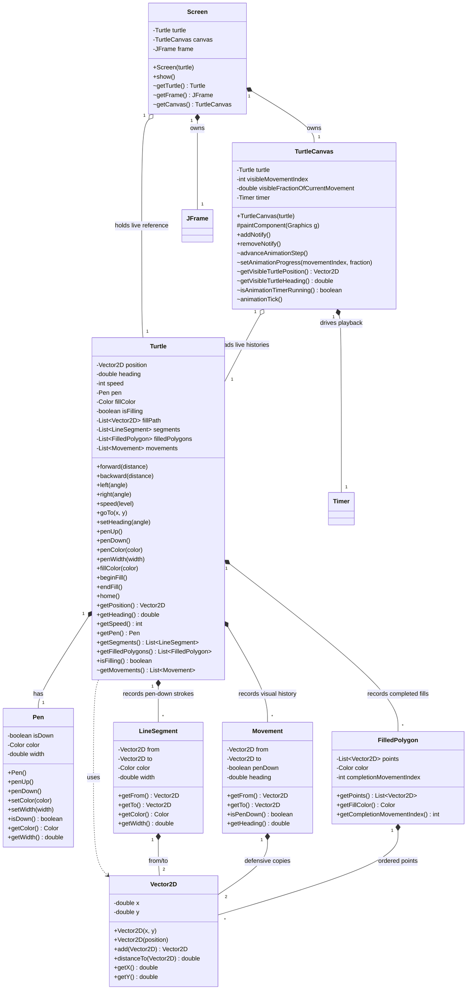

# Design — v1 Class Diagram

Epics 1–5 are implemented and tested. The v1 architecture separates the
headless turtle model from Swing rendering: model commands update final state
immediately, while `TurtleCanvas` owns visual playback, drawing order, and the
visible turtle cursor.

## Model decisions

- `Turtle` is independent of `Screen` and Swing. It stores position, heading,
  speed, pen state, fill state, stroke history, completed polygons, and movement
  history. `java.awt.Color` is used only as a value type.
- `Pen` is a separate mutable object so motion logic remains decoupled from
  drawing style. A `LineSegment` captures color and width when it is recorded,
  so later pen changes do not alter earlier strokes.
- `Vector2D`, `LineSegment`, `Movement`, and `FilledPolygon` represent
  historical values. `Movement` and `FilledPolygon` defensively copy
  coordinates when returning them.
- `getSegments()` and `getFilledPolygons()` expose unmodifiable views.
  Movement history is package-private because it is an implementation contract
  between the model and renderer rather than part of the public turtle API.
- Heading uses degrees. Heading `0` points east and positive turns are
  counter-clockwise. `left` and `right` normalize to `[0, 360)`;
  `setHeading` preserves the supplied value.
- `forward(0)` is a no-op. Other movement routes through the private
  `goTo(Vector2D)`, which records one `Movement`, optionally records one
  `LineSegment` when the pen is down, contributes a fill vertex when filling,
  and then updates the final position.
- Speed defaults to `3`. Levels `1`–`10` mean slow-to-fast playback and
  `0` means instant. Values from `0.5` through below `10.5` are rounded;
  values outside that range become `0` by project choice.

## Fill lifecycle and rendering

- `beginFill()` starts an in-progress path with the current turtle position.
  Calling it while already filling throws `IllegalStateException`.
- Every recorded movement contributes its destination to an active fill path,
  including pen-up movement. Pen-up movement does not create a line segment.
- `endFill()` publishes a polygon only when at least three points exist. The
  polygon captures its fill color and the index of the last movement belonging
  to the fill.
- A completed polygon remains visually hidden until its completion movement is
  fully visible. This prevents a fill from appearing ahead of its animated
  outline.
- Each repaint uses this order:
  1. visible completed fills;
  2. visible full or partial pen-down strokes;
  3. the turtle cursor.
  Painting the cursor last keeps it visible above fills and strokes.
- Self-intersecting polygons use Java2D's fill rule. As with Python turtle,
  overlap behavior is graphics-system dependent.

## Animation model

- Movement methods update the headless model to its final state immediately and
  return. Animation affects only what the Swing renderer currently reveals.
- `Movement` records from/to positions, pen state, and historical heading for
  every movement, including pen-up movement. `LineSegment` remains a separate,
  pen-down-only stroke history.
- Movement and segment indexes are intentionally different. The renderer walks
  the movement list in command order and advances its segment index only for
  pen-down movements.
- `TurtleCanvas` owns `visibleMovementIndex` and
  `visibleFractionOfCurrentMovement`. Together they form the visual cursor for
  strokes, fills, turtle position, and historical heading.
- The canvas constructor marks movements that already exist as visible.
  Movements recorded afterward remain pending and are revealed in order.
- A 16 ms Swing `Timer` calls `animationTick()`, which advances the cursor
  and requests a repaint. `addNotify()` starts the timer when the component
  becomes displayable; `removeNotify()` stops it.
- Swing `Timer` callbacks run on the Event Dispatch Thread, so animation state
  and repaint scheduling share Swing's thread.
- For speeds `1`–`10`, each tick adds `speed / 100.0` to the active
  movement's visible fraction. This is a simple, distance-independent timing
  model. Speed `0` moves the cursor directly to the end of all pending
  movements.
- The visible turtle position is linearly interpolated between the active
  movement's endpoints. Its visible heading comes from that movement; once all
  movement is visible, the canvas uses the turtle's final position and heading.
- Package-private animation methods provide deterministic test seams without
  making wall-clock timing part of model tests.

## Screen and Swing ownership

- `Screen` is a façade, not a `JFrame` subclass. It owns the frame and canvas,
  retains the live turtle reference, and makes the frame visible through
  `show()`.
- The frame title is `Turtle Graphics`, its initial size is 800 by 600, and
  closing it disposes the window rather than terminating the process.
- `TurtleCanvas extends JPanel`, has a preferred size of 600 by 600, and uses
  the component's actual dimensions for coordinate conversion.
- `Screen` accessors for the turtle, canvas, and frame are package-private test
  hooks; they are not public library API.

## Turtle coordinate system

Turtle coordinates use a Cartesian coordinate system:

- `(0, 0)` is the center of the canvas.
- Positive x moves right; negative x moves left.
- Positive y moves up; negative y moves down.
- Turtle coordinates map to Swing pixels with:
  `screenX = canvasWidth / 2 + turtleX`
  `screenY = canvasHeight / 2 - turtleY`
- Conversion uses actual component dimensions, not only preferred size.
- The canvas owns this boundary so the headless model never stores screen
  coordinates.

## Headless rendering and animation tests

Tests can instantiate `TurtleCanvas`, set its size, paint into a
`BufferedImage`, and inspect pixels without opening a `JFrame`. This verifies
fill timing and color, outline ordering, pen-up behavior, partial movement,
cursor position and heading, Cartesian mapping, and non-square canvas sizes.

Model assertions do not depend on wall-clock time: movement reaches its final
model position immediately. Tests advance or set the canvas animation cursor
through package-private hooks, while separate lifecycle tests verify that the
Swing timer starts and stops with component displayability.
