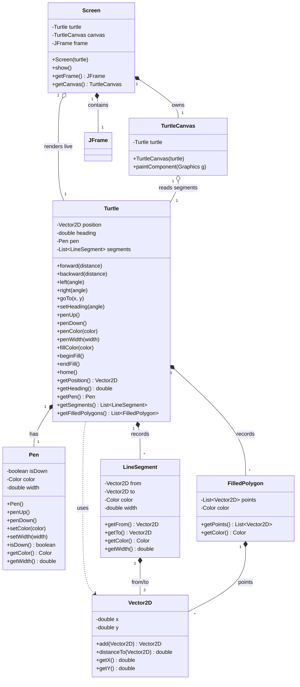

# Design — v1 Class Diagram

Epic 1 and Epic 2 classes are implemented and tested. Epic 3 adds pen styling. Epic 4 is planned as a separate shape-filling epic because it introduces polygon state and renderer behavior beyond individual line segments. The Swing rendering layer owns a live turtle reference, a `JFrame`, and a custom drawing `JPanel`.

## Notes / Decisions

- `Turtle` is self-contained in v1 — no dependency on `Screen`. It tracks its own position, heading, `Pen`, and drawn `LineSegment` history. This keeps Epic 1 fully headless and unit-testable.
- `Pen` is a separate object (not fields on `Turtle`) to mirror Python's `TPen` mixin and keep motion logic decoupled from drawing-style logic.
- `Vector2D` is immutable — operations return new instances rather than mutating in place.
- `LineSegment` is immutable — all fields are `final`; captures pen color and width at draw time.
- Epic 4 will represent completed fills as immutable `FilledPolygon` values containing ordered turtle-space points and a fill color captured when the fill is completed.
- `Turtle` will own fill state (`fillColor`, active/inactive status, and the in-progress path). `beginFill()` starts at the current position; `endFill()` publishes a polygon only when at least three points are available.
- Fill recording remains headless. Movement with the pen up will contribute points to an active fill path but will not create `LineSegment` values.
- `Turtle` is mutable with getters. `getSegments()` returns an unmodifiable view.
- Heading is stored in degrees, normalised to `[0, 360)` after every `left`/`right` call. Conversion to radians happens only inside `forward` when computing trig.
- Heading convention: 0° = east, increases counter-clockwise (standard math / Python turtle).
- `forward(0)` is a no-op — returns early before computing position or recording a segment.
- `forward` delegates to a private `goTo(Vector2D)` overload; the public `goTo(double, double)` also delegates to it. All movement and segment-recording logic lives in one place.
- `Screen` is a façade around a Swing window: it owns a live `Turtle` reference, creates a `JFrame`, and adds a custom `TurtleCanvas` to the frame.
- `Screen` is intentionally not a subclass of `JFrame`; it owns the frame as a separate object to avoid recursion and keep the API more explicit and testable.
- `TurtleCanvas extends JPanel` and overrides `paintComponent` to iterate `turtle.getSegments()`. Each segment is painted using its stored `Color` and `width`.
- For Epic 4, `TurtleCanvas` will render completed `FilledPolygon` values before line segments, mapping every vertex with the existing coordinate transform so the pen outline remains visible.
- The render loop intentionally reads the live turtle state on each repaint, which keeps the screen synchronized with the turtle and supports Epic 4 animation without changing the screen API.

### Turtle coordinate system

Turtle coordinates use a Cartesian coordinate system:

- `(0, 0)` is the center of the canvas.
- Positive x moves right.
- Negative x moves left.
- Positive y moves up.
- Negative y moves down.
- Turtle coordinates are converted to Swing pixel coordinates with:
  `screenX = canvasWidth / 2 + turtleX`
  `screenY = canvasHeight / 2 - turtleY`
- The conversion uses the actual component dimensions, not only the preferred size.
- This is the exact boundary for Story 2.3 and keeps the coordinate logic isolated in the canvas, not in the turtle model.