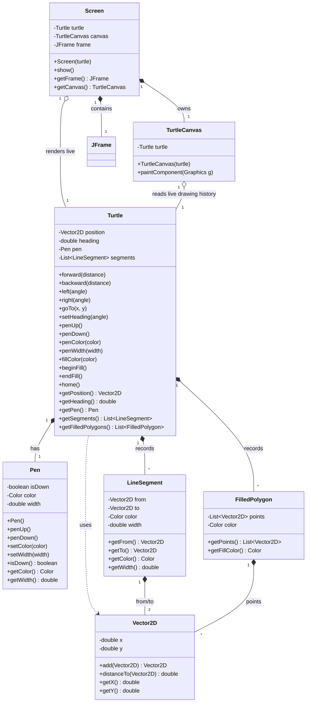

# Design — v1 Class Diagram

Epics 1–4 are implemented and tested. Epic 3 adds pen styling, and Epic 4
adds completed polygon state plus renderer behavior beyond individual line
segments. The Swing rendering layer owns a live turtle reference, a `JFrame`,
and a custom drawing `JPanel`; the model itself remains usable without Swing.

## Notes / Decisions

- `Turtle` is self-contained in v1 — no dependency on `Screen`. It tracks its own position, heading, `Pen`, and drawn `LineSegment` history. This keeps Epic 1 fully headless and unit-testable.
- `Pen` is a separate object (not fields on `Turtle`) to mirror Python's `TPen` mixin and keep motion logic decoupled from drawing-style logic.
- `Vector2D` is immutable — operations return new instances rather than mutating in place.
- `LineSegment` is immutable — all fields are `final`; captures pen color and width at draw time.
- Completed fills are immutable `FilledPolygon` values containing ordered turtle-space points and a fill color captured when the fill is completed.
- `Turtle` owns fill state (`fillColor`, active/inactive status, and the in-progress path). `beginFill()` starts at the current position; `endFill()` publishes a polygon only when at least three points are available.
- Fill recording remains headless. Movement with the pen up contributes points to an active fill path but does not create `LineSegment` values.
- `Turtle` is mutable with getters. `getSegments()` returns an unmodifiable view.
- Heading is stored in degrees, normalised to `[0, 360)` after every `left`/`right` call. Conversion to radians happens only inside `forward` when computing trig.
- Heading convention: 0° = east, increases counter-clockwise (standard math / Python turtle).
- `forward(0)` is a no-op — returns early before computing position or recording a segment.
- `forward` delegates to a private `goTo(Vector2D)` overload; the public `goTo(double, double)` also delegates to it. All movement and segment-recording logic lives in one place.
- `Screen` is a façade around a Swing window: it owns a live `Turtle` reference, creates a `JFrame`, and adds a custom `TurtleCanvas` to the frame.
- `Screen` is intentionally not a subclass of `JFrame`; it owns the frame as a separate object to avoid recursion and keep the API more explicit and testable.
- `TurtleCanvas extends JPanel` and overrides `paintComponent` to render completed polygons before `turtle.getSegments()`. Each polygon uses its stored fill color; each segment uses its stored `Color` and `width`.
- Polygon vertices use the existing coordinate transform, so line segments remain the visible outlines after filling.
- The render loop intentionally reads the live turtle state on each repaint, keeping the screen synchronized with the turtle.
- Animation is renderer-owned: movement methods update the headless model and return immediately, while Swing maintains separate visual progress.
- The animation cursor, including the visible-segment index and progress along the active segment, belongs to a Swing-side controller or canvas state; it is never stored in `Turtle`.
- Commands issued during animation are accepted immediately; the renderer reveals recorded movements sequentially in command order.
- Speed `0` bypasses visual interpolation and displays the complete current model state immediately.
- Self-intersecting polygons use Java2D's fill behavior. Python documents overlap regions as graphics-system dependent, so the center of a five-point star may remain the background color.

### Turtle coordinate system

Turtle coordinates use a Cartesian coordinate system:

- `(0, 0)` is the center of the canvas.
- Positive x moves right.
- Negative x moves left.
- Positive y moves up.
- Negative y moves down.
- Turtle coordinates are converted to Swing pixel coordinates with:
  `screenX = canvasWidth / 2 + turtleX`
  `screenY = canvasHeight / 2 - turtleY`
- The conversion uses the actual component dimensions, not only the preferred size.
- This coordinate boundary is shared by segment and polygon rendering and keeps mapping logic isolated in the canvas, not in the turtle model.

### Headless rendering contract

Tests can instantiate `TurtleCanvas`, set its size, paint into a
`BufferedImage`, and inspect pixels without opening a `JFrame`. This validates
fill color, background preservation, outline ordering, pen-up path behavior,
positive/negative Y mapping, and non-square canvas dimensions.

Animation tests should keep model assertions independent from wall-clock time:
the model reaches its final position immediately, and only the Swing renderer's
visual progress is time-dependent. A Swing `Timer` should advance that progress
on the Event Dispatch Thread and reveal commands in recorded order.