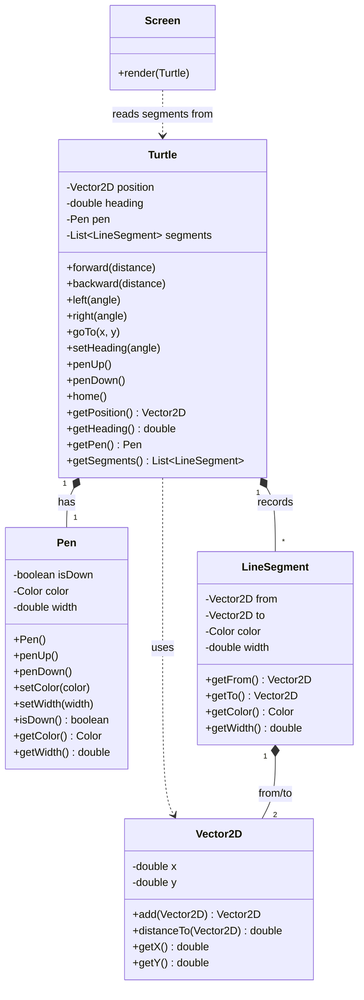

# Design — v1 Class Diagram

Essential classes for Epic 1 (headless core model). `Screen` rendering comes in Epic 2.

## Notes / Decisions

- `Turtle` is self-contained in v1 — no dependency on `Screen`. It tracks its own position, heading, `Pen`, and drawn `LineSegment` history. This keeps Epic 1 fully headless and unit-testable.
- `Pen` is a separate object (not fields on `Turtle`) to mirror Python's `TPen` mixin and keep motion logic decoupled from drawing-style logic.
- `Vector2D` is immutable — operations return new instances rather than mutating in place.
- `LineSegment` is immutable — all fields are `final`; captures pen color and width at draw time.
- `Turtle` is mutable with getters. `getSegments()` returns an unmodifiable view.
- Heading is stored in degrees, normalised to `[0, 360)` after every `left`/`right` call. Conversion to radians happens only inside `forward` when computing trig.
- Heading convention: 0° = east, increases counter-clockwise (standard math / Python turtle).
- `forward(0)` is a no-op — returns early before computing position or recording a segment.
- `forward` delegates to a private `goTo(Vector2D)` overload; the public `goTo(double, double)` also delegates to it. All movement and segment-recording logic lives in one place.
- `Screen` (Epic 2) is a pure renderer: it reads a `Turtle`'s recorded `LineSegment`s and paints them; it does not own turtle state.
